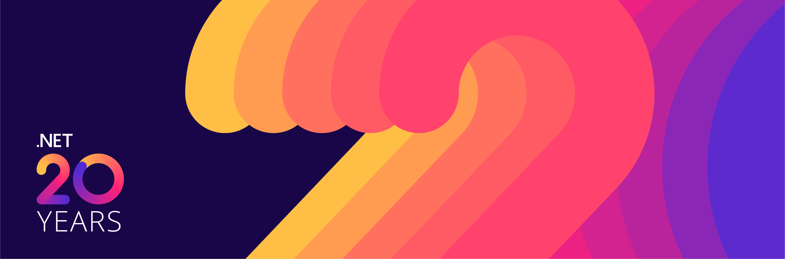

# .NET 20th Anniversary
*This repo contains social creative and digital swag to support the .NET 20th anniversary celebration*

Twenty years ago, on February 13th, 2002, Visual Studio .NET launched and the first version of the .NET development platform was officially released to the world. All month long we'll be celebrating this huge milestone.

## Live Broadcast February 14, 9:00AM Pacific Time
On February 14th starting at 9AM pacific on [www.dot.net](https://dot.net), Microsoft will broadcast a live 30-minute event featuring:

- Interviews with luminaries & Microsoft alumni
- Stories from customers and developers building amazing things at cloud scale
- Memories of building .NET with [Scott Hunter](https://twitter.com/coolcsh), [Scott Hanselman](https://twitter.com/shanselman), and special guests
- …and so much ❤ from OSS contributors, MVPs, and .NET team members

Watch the stream or organize a watch party on February 14th 9:00AM Pacific Time and engage in the live chat during the broadcast on the homepage of [www.dot.net](https://dot.net).

## Celebration on Social
Celebrate with the community throughout the month of February on social media. Microsoft, the .NET Foundation, and ecosystem partners are joining the celebration with digital swag, trivia games and more. Have a fond memory? Still have that PDC conference badge? Did you build something amazing?

**Share your stories, memorabilia, favorite features, etc. in picture or video form on Twitter using the hashtag [#dotNETLovesMe](https://twitter.com/hashtag/dotnetlovesme).**

## Digital swag
Grab desktop wallpapers and backgrounds as well as printable designs perfect for the top of a cake or a t-shirt!

See the [`Swag`](Swag) folder.

## Mod the dotnet-bot
We've added new birthday and party designs to [Mod-dotnet-bot.net](https://mod-dotnet-bot.net/). Create your own custom coding companion by modding the dotnet-bot and sharing it on Twitter as part of the celebration.

